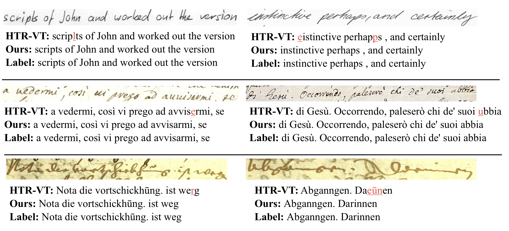

# HTR-MB: Combining Mamba and BiLSTM for Handwritten Text Recognition


### Introduction
This is the official implementation of **HTR-MB**, a state-of-the-art Mamba-based architecture for Handwritten Text Recognition (HTR). Unlike Transformer-based approaches that suffer from quadratic complexity, non-monotonic attention, and poor memory efficiency during inference, our method leverages Mamba's linear complexity and monotonic nature combined with a BiLSTM head to effectively model short-range dependencies in handwritten text.

### HTR-MB Solution

## Architecture
<p align="center">

</p>

## 4. Visual Results
<p align="center">

</p>

## Installation

```bash
conda create -n htr python=3.11
conda activate htr
pip install -r requirements.txt
```

### Datasets

* We evaluate on **IAM, READ2016 and LAM** datasets, achieving state-of-the-art results on all benchmarks.

</summary>
  <details>
   <summary>
   IAM
   </summary>
    
    Register at the FKI's webpage :https://fki.tic.heia-fr.ch/databases/iam-handwriting-database)
    Download the dataset from here :https://fki.tic.heia-fr.ch/databases/download-the-iam-handwriting-database
  </details>
  <details>
   <summary>
   READ2016
   </summary>
    
    wget https://zenodo.org/record/1164045/files/{Test-ICFHR-2016.tgz,Train-And-Val-ICFHR-2016.tgz}
  </details>
  <details>
   <summary>
   LAM
   </summary>
    
    Download the dataset from here: https://aimagelab.ing.unimore.it/imagelab/page.asp?IdPage=46
  </details>
  
* Download datasets to ./data/.
Take IAM for an example:
The structure of the file should be:

```
./data/iam/
├── train.ln
├── val.ln
├── test.ln
└── lines
      ├──a01-000u-00.png
      ├──a01-000u-00.txt
      ├──a01-000u-01.png
      ├──a01-000u-01.txt
      ...
```


### Training
Run the following script
```bash
sh run/train.sh
```

### Results

HTR-MB achieves **state-of-the-art performance** across all evaluated datasets:

| Dataset | CER ↓ | WER ↓ |
|---------|-------|-------|
| IAM |4.42 | 14.01 |
| READ2016 | 3.49 | 15.07 |
| LAM | 2.69 | 7.15 |

*Detailed results and ablation studies available in the paper.*

<!-- ## 7. Citation -->

<!-- Currently under submission. -->


## 8. Acknowledgement

We appreciate helps from public code: [VAN](https://github.com/FactoDeepLearning/VerticalAttentionOCR), [OrigamiNet](https://github.com/IntuitionMachines/OrigamiNet), and [HTR-VT](https://github.com/Intellindust-AI-Lab/HTR-VT).  
